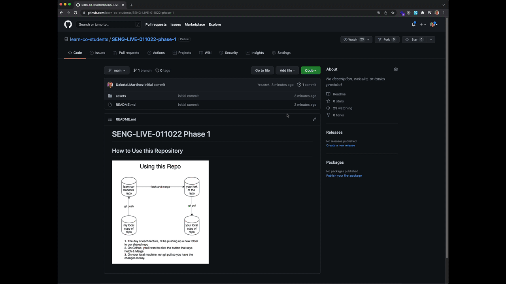
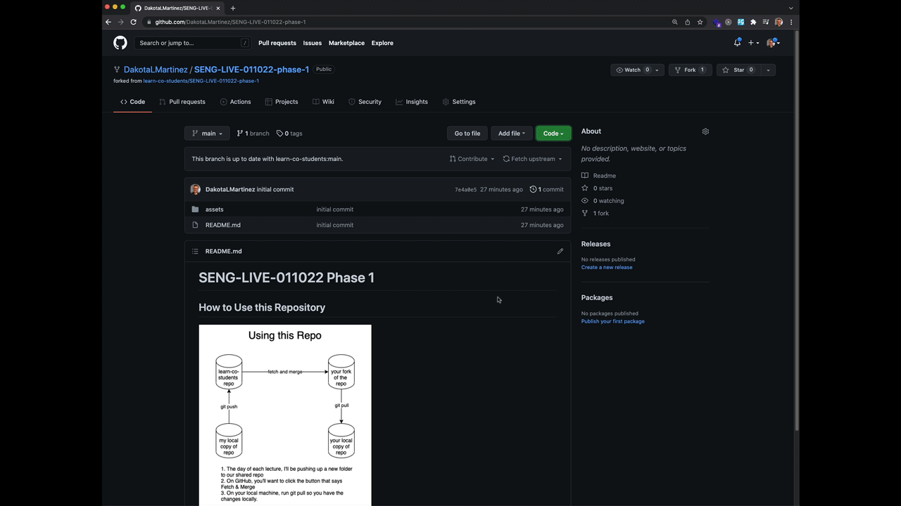
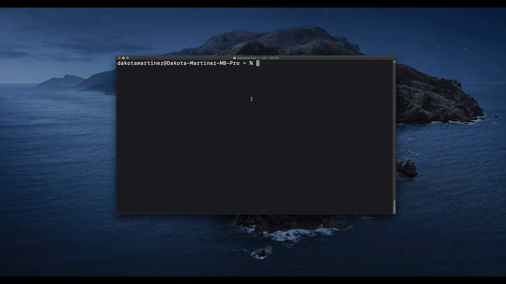

# SENG-LIVE-011022 Phase 1

## How to use this repository

## Day 1 Instructions

### Fork this repository

- Click on the Fork Icon at the top of the UI and wait for the forking operation to complete
- I needed to select my username here to indicate I want to fork to my account because I'm part of multiple organizations

### Clone your fork of the repository to your local machine

To do this there are a two main tasks we'll want to complete. 

1. Get the SSH link for your fork of the repository
2. Clone the repository to a folder on your local machine

#### 1. Getting the SSH link to clone the repository

- Once the fork is complete, click on the green code button
- in the sub menu that appears, make sure that SSH is underlined
- click the clipboard button to copy the ssh link to your clipboard

#### 2. Cloning the forked repository to a folder on your local machine
- open up a terminal and navigate to the directory where you want to store your lecture code
  - In my case I'm creating the folder through the terminal using the `mkdir lecture-code` command
  - next, `cd lecture-code` to move my terminal's working directory into the `lecture-code` folder
- run `git clone <pasteyoursshgitrepolinkhere>` in the terminal
- run `code SENG-LIVE-011022-phase-1` to open the repository within VSCode

> **PRO TIP** If you type the `tab` key on your keyboard while interacting with the terminal, you can autocomplete long file or folder names.  In this case, I typed `code SENG` and then hit the `tab` key and it expanded the path to the only folder name matching `SENG` which was `SENG-LIVE-011022-phase-1`. So, you only need to type as many characters as can uniquely identify the file or folder name that you want to open and then you can use `tab` to complete the rest of the required typing without typos!

Now that you have the repository cloned to your local machine, you'll be able to following along with lecture inside of your own code editor if you wish. 

## Before Every Subsequent Lecture

1. Click on the Fetch & Merge button on your fork of the repository on GitHub.
2. Run `git pull` from within the attached terminal of your local copy of the repository in VS Code. 

## Merge Conflicts

If all goes well, you should not encounter merge conflicts when you follow this workflow as part of participation in lecture. There is one scenario where they might come up, so I want to describe it here and how to address it.

### Scenario

Say these events happen in this order:

1. Your lecturer sends out a message in Slack notifying the class that starter code is ready to fetch and merge before lecture. 
2. You go through the steps above and pull down the updated code to your machine. 
3. You start taking some notes there and attempting to solve problems in the starter code.
4. The lecturer notices something in the lecture code that they want to change and pushes another commit to the lecture repo.

In this case, going through the `fetch & merge` and `git pull` workflow may result in what's called a merge conflict. The safest thing to do in this situation is to run `git stash` locally to hide your changes in your local repository so that the `pull` from GitHub goes off without a hitch. You can still view the code within your stash within VSCode and you can even return it to your machine with `git stash pop` if you like.

If this scenario arises, your lecturer will generally communicate the change in advance, so this scenario should be rare. But, should it happen, this is one approach you can take to get around any potential problems.